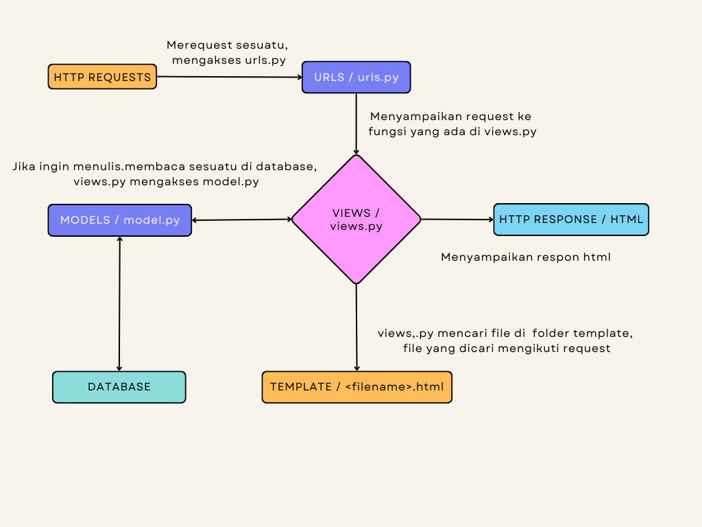

## Bagan

## Jelaskan kenapa menggunakan virtual environment? Apakah kita tetap dapat membuat aplikasi web berbasis Django tanpa menggunakan virtual environment?
Virtual environtment membantu kita menginstal packages serta dependencies ,yang belum diinstal secara global, yang dibutuhkan di framework django. Kita tetap dapat membuat aplikasi web berbasis django namun lebih sulit tanpa virtual environtment. Virtual environtment membantu kita untuk membuat sebuah lingkungan yang tertutup sehingga jika kita sedang mengerjakan beberapa proyek, tidak akan terjadi timpang tubruk.

## Jelaskan bagaimana cara kamu mengimplementasikan poin 1 sampai dengan 4 di atas.
1. Fungsi untuk mengambil data diimplementasikan menggunakan syntax CatalogItem.objects.all(). Fungsi untuk mengembalikan data ke html diimplementasikan menggunakan syntax render().

2. Routing terhadap fungsi di views.py dilakukan dengan menambah syntax path() di urls.py. path() juga ditambahkan di folder project django.

3. Menambahkan variabel context dan melakukan render dengan syntax render(..., context)

4. Membuat app baru di heroku dan menyambungkan repo tugas 2 ke pbp dengan menambahkan API value dan nama app di secrets.

## Links
https://alifilhamtugas2pbp.herokuapp.com/
https://alifilhamtugas2pbp.herokuapp.com/katalog/