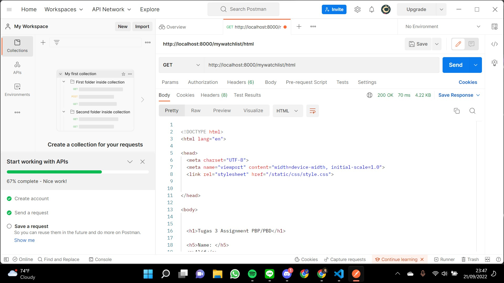
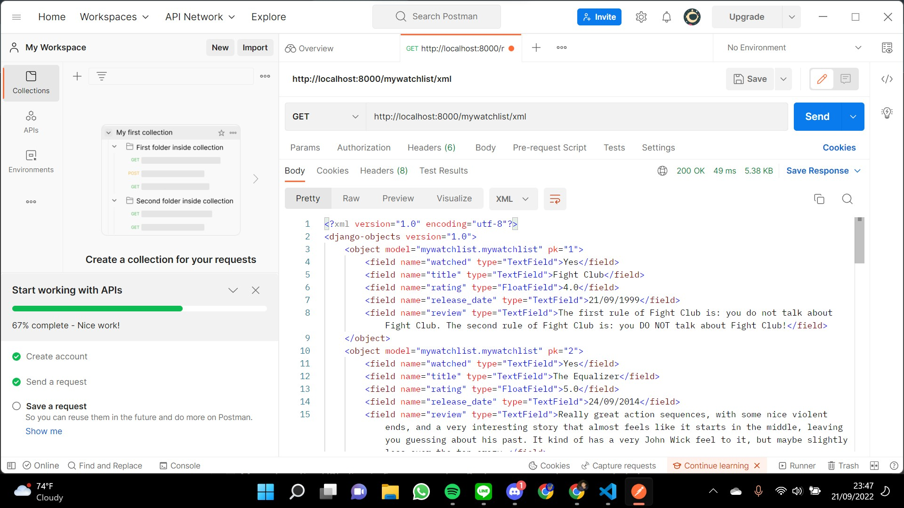
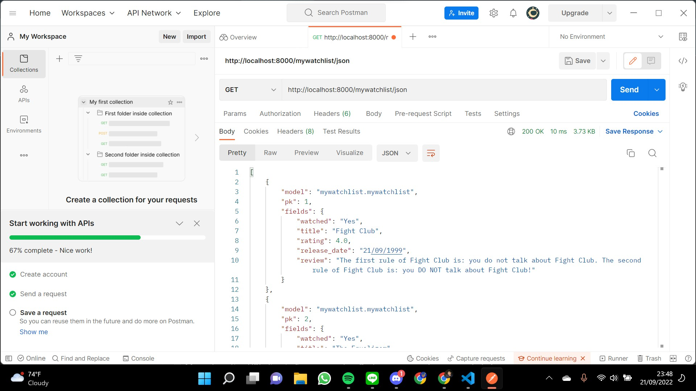

## Links
https://alifilhamtugas2pbp.herokuapp.com/
https://alifilhamtugas2pbp.herokuapp.com/mywatchlist/

## Perbedaan antara JSON, XML, HTML
JavaScript Object Notation atau JSON adalah format yang digunakan untuk menyimpan serta merepresentasikan data, proses pembuatan dan pengiriman di JSON lebih cepat karena ukurannya yang ringan.

Extensible Markup Language atau XML adalah bahasa markup yang digunakan untuk mengsimplifikasikan proses penyimpanan data. Jika dilihat, file XML lebih sulit dibaca dibandingkan JSON.

Hypertext Markup Language atau HTML adalah bahasa markup yang digunakan untuk menyusun struktur sebuah web.

Struktur yang digunakan di JSON adalah turunan syntax-xyntax javascript sedangkan XML memakai struktur tag untuk merepresentasikan data-data.

Perbedaan antara HTML dan XML adalah di fungsi pemakaiannya. XML lebih digunakan untuk menyimpan serta mentransfer data sedangkan HTML digunakan untuk menampilkan data tersebut.

## Mengapa kita memerlukan data delivery
Data delivery penting untuk pertukaran data dalam aplikasi, client to server atau server to client. Data delivery juga membantu pengemasan dan pengiriman data dalam bentuk yang bisa kita dan komputer pahami. Biasanya data delivery menggunakan format yang sudah kita kenal, yakni JSON, XML, HTML.

## Mengimplementasikan poin 1 sampai dengan 3
1. Menjalankan perintah python manage.py startapp mywatchlist untuk membuat aplikasi mywatchlist.

2. Menambahkan path('mywatchlist/', include('mywatchlist.urls')) di urls.py (project_django) untuk menghubungkan urlpatterns yang ada pada project_django ke mywatchlist dan menambahkan mywatchlist pada installed_app yang ada di setting.py(project_django). Melakukan path route dalam urls.py (mywatchlist) agar terhubung dengan fungsi yang akan dijalankan pada views.py (mywatchlist).

3. Membuat model data pada models.py (mywatchlist) dengan fields watched, title, rating, release_date, review. Lalu melakukan migrasi dengan menjalankan command python manage.py makemigrations dan python manage.py migrate

4. Membuat folder fixtures di mywatchlist lalu membuat file initial_mywatchlist_data.json untuk menginput 10 data film seperti yang ada di models dan akan di load agar dapat ditampilkan kedalam url.

5. Mengimplementasi fungsi untuk menampilkan data dalam bentuk html,json, dan xml pada file views.py (mywatchlist). Untuk html memakai fungsi render dan untuk json/xml memakai fungsi HttpResponse.

6. Menambahkan routing buat html, json, dan xml dengan menambahkan path urlspath
    path('xml/', show_xml, name='show_xml')
    path('json/', show_json, name='show_json')
    path('html/', show_html, name='show_html')
    di urls.py (mywatchlist).

## Screenshot Postman

